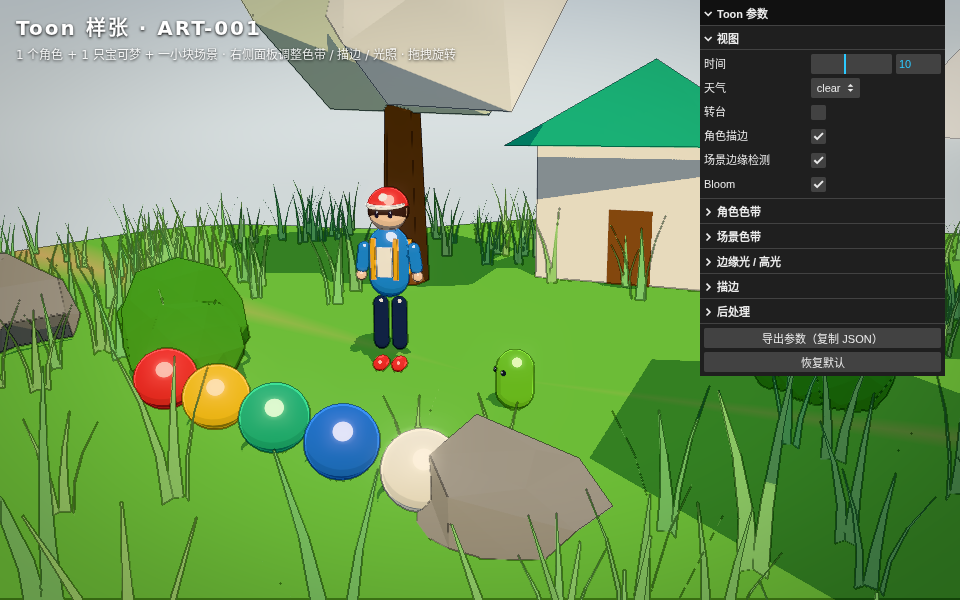
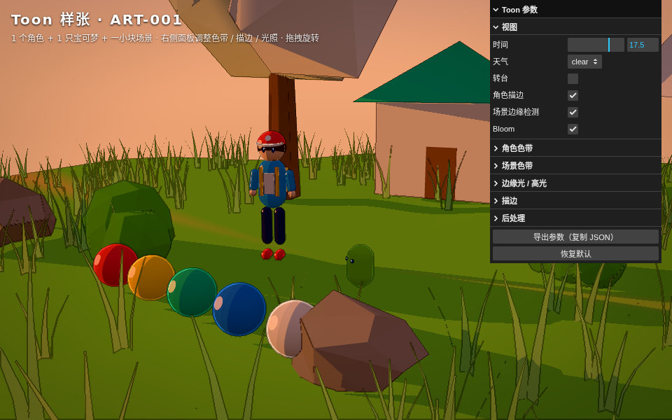
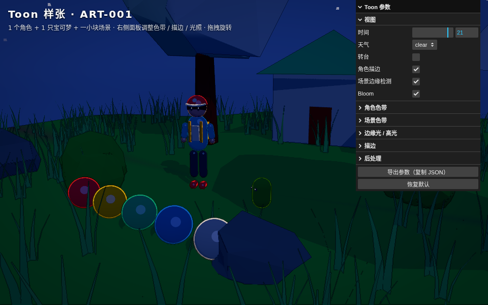
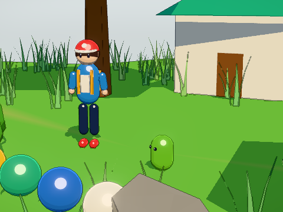

# ART-001 · Toon 风格样张

样张页：`style-guide.html`（`pnpm dev` 后打开 `/style-guide.html`；参数 `?hour=0~24`、`?lite`）。
源码：`src/devtools/styleGuide.ts`；**定稿参数的唯一来源**：`src/render/toon/presets.ts` 的 `DEFAULT_STYLE`。

场景内容：训练家（程序化人物模型）+ 木木枭（ENG-008 灰模占位，正式模型见 M1-21）+ 一小块场景（地面、道路、树、房屋、岩石、灌木、实例化草簇）+ 五色参考球（红/黄/绿/蓝/米白，一眼看出三阶色带）。

## 截图（软件渲染 960×600，真实 GPU 下阴影与抗锯齿更好）

| 10:00 晴 | 17:30 黄昏 | 21:00 夜晚 |
|---|---|---|
|  |  |  |

特写：

## 定稿参数

| 组 | 参数 | 值 | 说明 |
|---|---|---|---|
| 角色色带 | 阈值（暗→中 / 中→亮） | 0.47 / 0.62 | 明暗交界偏亮侧，脸部大面积落在亮带 |
| | 三阶亮度 | 0.52 / 0.80 / 1.00 | 暗部不低于 0.5，避免“脏” |
| | 暗部色偏 | `#8f9ed8` | 冷紫蓝阴影，卡通感的核心 |
| | 过渡柔和 | 0.012 | 硬边，但抗锯齿不闪 |
| 场景色带 | 阈值 | 0.42 / 0.60 | |
| | 三阶亮度 | 0.62 / 0.84 / 1.00 | 暗部比角色亮，大面积地形不发黑、角色更突出 |
| | 暗部色偏 / 柔和 | `#9aa9d6` / 0.03 | 过渡更宽，远景不出现色阶条纹 |
| 边缘光 | 颜色 / 强度 / 阈值 / 宽度 | `#fff6e0` / 0.42 / 0.62 / 0.05 | 暖白窄边，只在背光侧出现 |
| 高光 | 强度 / 大小 | 0.35 / 0.965 | 小而硬的点高光，只给角色 |
| 外壳描边（角色） | 宽度 | 0.0028 | ≈ 屏幕 2.5–3 px，随距离恒定 |
| | 颜色 | 基色 × 0.32，与 `#1d2238` 混合 | 有色描边，不用纯黑 |
| 边缘检测（场景） | 强度 / 深度阈值 / 法线阈值 | 0.7 / 0.012 / 0.45 | |
| | 颜色 / 淡出 | `#27304a` / 40–140 m | 远处淡出，避免远景糊成一片线 |
| 后处理 | Bloom 强度 / 半径 / 阈值 | 0.35 / 0.5 / 0.92 | 只给高光、灯光、水面反光 |
| | 曝光 / 饱和度 | 1.00 / 1.08 | |

画质档位：低 = 关边缘检测和 Bloom，只保留角色外壳描边；中 = 边缘检测半分辨率；高 = 全开（见 `src/render/quality.ts`）。

## 规则

1. 改画风只改 `presets.ts`。在样张页调好 → 点「导出参数（复制 JSON）」→ 粘贴进 `DEFAULT_STYLE` → 重新截图并更新本表。
2. 新模型贴图以**平涂色块**为主，不要画明暗（明暗由色带负责）；最多画少量固有阴影（如帽檐下）。
3. 验收新模型时，把它放进样张页，在 10:00 / 17:30 / 21:00 三个时间下对比参考球，确认暗部不发黑、描边颜色协调。
4. 岛屿可以在 `IslandConfig` 里覆盖场景色带的色偏（如沙滩岛更暖），角色色带全局统一。

## 已知问题

- 草簇几何没有顶点色，原先按材质白色渲染成“白草”；现在给每个实例单独设了绿色（2026-09-29 已修正）。
- 木木枭目前是胶囊灰模；正式模型完成后（M1-21）替换进样张页，重新截图。
